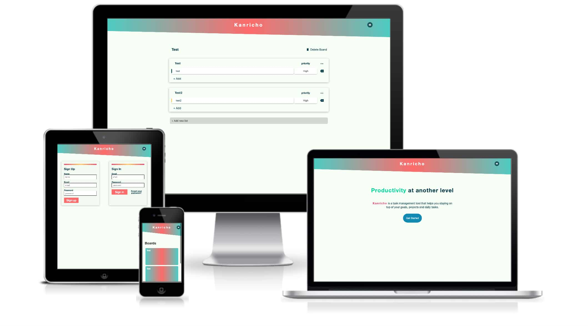

<h1> Kanricho.com</h1>

Kanricho is a task management app.

 
 

## What I did

  This app was created to experiement with the tech stack and as a tool that I
  can use with specific features based on my requirements.
   
   
  <li>Create, update, delete boards, lists and cards per user.</li>
  <li>
    {" "}
    Account creation and permission for user to update/delete/create their boards{" "}
  </li>

 

## Libraries / Tools

<li> React using Next.js for server side rendering, routing and tooling.</li>
<li> Styled Compontents for styling.</li>
<li> React Apollo to iterface with Apollo Client.</li>
<li>
  Apollo Client to perform GraphQL Mutations and fetching Queries, Caching data
  and using error/loading UI states.
</li>
<li>
  {" "}
  GraphQL Yoga to implement Query/Mutation resolvers, sending emails and performing
  JWT authenication.
</li>
<li>
  {" "}
  Prisma to use CRUD APIs for MySQL database, schema definition, data relationships,
  queried data from Yoga server.
</li>

[Go to Web Site →](https://kanricho.com/)

[Go to Web Site Repo →](https://github.com/gabroun/kanricho)

