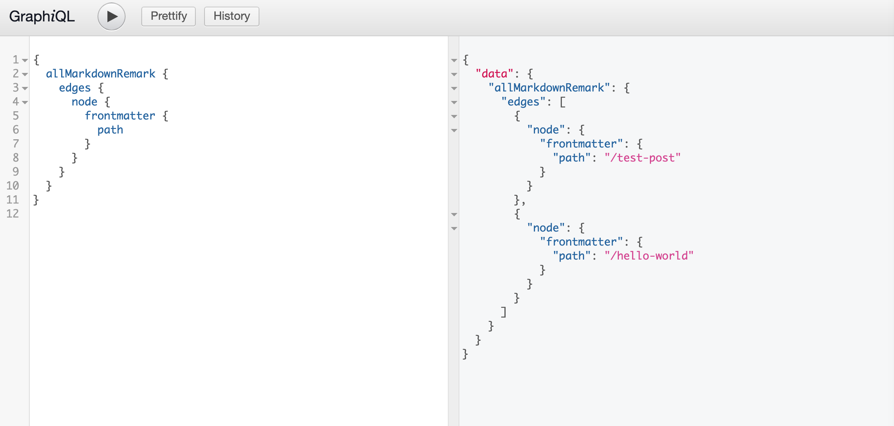

import ReadMore from "../../../src/components/ReadMore/Index";

In this post, we will be looking into how you can create pages programmatically from data (markdown files) in Gatsby.

In order to create these pages dynamically from markdown, we will be looking into Gatsby's Node `createPages` API.

However, before we can do that, we need to install a couple of plugins that will source and transform markdown file in order for Gatsby to understand the markdown files path and its content, and be able to create those pages.

To create pages you would need to do the following to make it happen dynamically:

1. Reading markdown files and transform them

By installing the following plugins

```shell
npm install --save gatsby-source-filesystem gatsby-transformer-remark
```

We tell Gatsby about our content path with `gatsby-source-filesystem` from the filesystem by passing an options object that contains a variable and file path.

In addition, we can transform those markdown files content to HTML and frontmatter metadata to frontmatter by using `gatsby-transformer-remark`, which will transform those files into edges that contain node type of MarkdownRemark and each frontmatter fields into GraphQL fields that we can query later in our pages/component and map them at build time.

In order to read the markdown files path and transform them into GraphQL fields, we need to add the following config to our `gatsby-config.js` after installing the two plugins.

```javascript
//gatsby-config.js
 `gatsby-transformer-remark`,
{
      resolve: `gatsby-source-filesystem`,
      options: {
        name: `posts`,
        path: `${__dirname}/content/posts`, // for the path you can change it based on your preferred folder structure
      },
},
```

2. create page component (template) for markdown files

we need to create a page template component that will be mapped with data (available GraphQL fields that were transformed with gatsby-transformer-remark) using graphql at build time to create these pages dynamically.

In the following below, you can see a simplified example of the post template I am using for the blog posts. **Note (you can create as many templates as you want)**

```jsx
import React from "react";
import { graphql } from "gatsby";

const Post = ({ data }) => {
  const { markdownRemark } = data;
  const { title, date } = markdownRemark.frontmatter;
  const { html, timeToRead } = markdownRemark;

  return (
    <div>
      <div className="post-wrapper">
        <Title>{title}</Title>
        <div>
          <p>{date}.</p>
          <p>{timeToRead} min read.</p>
        </div>
        <div className="blogpost" dangerouslySetInnerHTML={{ __html: html }} />
      </div>
    </div>
  );
};
```

Below we can see the specific data (GraphQL fields) are being pulled through and used in the template component above using out of the box GraphQL query.

```graphql
export const query = graphql`
  query($pathSlug: String!) {
    markdownRemark(frontmatter: { path: { eq: $pathSlug } }) {
      html
      frontmatter {
        title
        date
      }
      timeToRead
    }
  }
`;
```

3. programmatically create pages using gatsby's node `createPages` API

To create a new page, we need to do the following steps

- Generate the slug (path) for the page using createPages API
- create the page by mapping content (the transformed markdown file) to the page component template

In `gatsby-node.js` we export createPages API and pass it 2 arguments, `graphql` for finding the files and `actions` where createPage is a property of it.

The createPages function will return us a new promise due to the async nature of file creation (alternatively, you can use callback as per the example in gatsby docs).

In order to create these pages, we will need access to the page template using 'path.resolve'.

To change the status of promise to fulfilled, we will need to resolve it by calling graphql and pass it our query for allmarkdownremark with the path field included where we want our posts to live at. (this path field is the one we set in markdown frontmatter metadata).

Additionally, we pass a function to `.then` that will be invoked once status changed to fulfilled, where we pass our result value to this function. Result will contain a data object that will match our query as you can see in the screenshot.

In the function body, we will use foreach to iterate over each file node (edges are paths to the file system node) to extract the path from those nodes frontmatter.

you can console log node parameter and see the value returned for each markdown file from the query which will be similar to the screenshot below which will indicate what we can expect from the node content.


With path value available to us, now we can call the 'createPage' action which takes in 3 parameters, path for the page url, component to render (page template component) and context object that will be available to page component as a prop.
As we passing context object to template component we want our template to know the path to file which will be called pathslug because path is a reserved keyword and the value of the pathSlug will be the field supplied from node frontmatter. After createPage invocation, we will resolve the promise as you can see in the example below.

```javascript
exports.createPages = ({ graphql, actions }) => {
  const { createPage } = actions;
  return new Promise((resolve, reject) => {
    // to create the page we need access to the blog post template
    const postTemplate = path.resolve("src/templates/postTemplate.js");
    resolve(
      graphql(
        `
          {
            allMarkdownRemark {
              edges {
                node {
                  frontmatter {
                    path
                  }
                }
              }
            }
          }
        `
      ).then((result) => {
        if (result.errors) {
          console.log(result.errors);
          reject(result.errors);
        }
        result.data.allMarkdownRemark.edges.forEach(({ node }) => {
          // you can see node value in the screenshot
          const path = node.frontmatter.path;

          createPage({
            path,
            component: postTemplate,
            context: {
              /*
              the value passed in the context will be available for you to use in your page queries as a GraphQL variable, as per the template snippet */
              pathSlug: path,
            },
          });
          resolve();
        });
      })
    );
  });
};
```

You can see the result of the graphql query in the above snippet when ran in GraphiQl below



**Here is a [Demo](https://peaceful-davinci-7ffc1f.netlify.com/) of Gatsby createPages following the post and you can find the repo [here](https://github.com/gabroun/gatsby-starter-example)**

<ReadMore link1="/blog/gatsby-create-pages-with-mdx/" />
