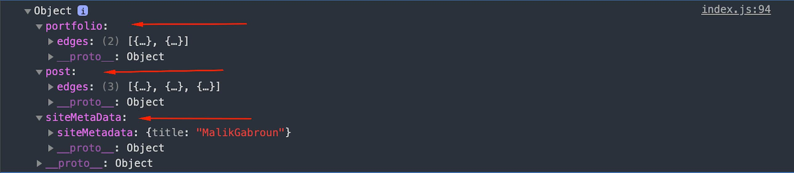

import ReadMore from "../../../src/components/ReadMore/Index";

Say you want to fetch specific data in one page based on an argument or a condition which can't be run using one query as you can't query the same field with different condition or argument. One way of doing that by using [GraphQL aliases](https://graphql.org/learn/queries/#aliases) which you can use to rename the returned dataset to anything you want.

## Example

```graphql {3,23}
export const query = graphql`
  query {
    post: allMarkdownRemark(
      limit: 3
      sort: { order: DESC, fields: [frontmatter___date] }
      filter: { frontmatter: { type: { ne: "portfolio" } } }
    ) {
      edges {
        node {
          timeToRead
          frontmatter {
            title
            path
            date(formatString: "DD MMMM YYYY")
            summary
            images
            tags
            type
          }
        }
      }
    }
    portfolio: allMarkdownRemark(
      sort: { order: DESC, fields: [frontmatter___date] }
      filter: { frontmatter: { type: { eq: "portfolio" } } }
    ) {
      edges {
        node {
          frontmatter {
            title
            path
            images
            tags
            type
          }
        }
      }
    }
    siteMetaData: site {
      siteMetadata {
        title
      }
    }
  }
`;
```

Looking at the above example, we can see the query I made will return multiple datasets by giving it an alias which allowed me to run multiple queries with different arguments and conditions to get the specific data object I needed as you can see in the screenshot.



<ReadMore link1="/blog/use-statc-query-hook/" />
