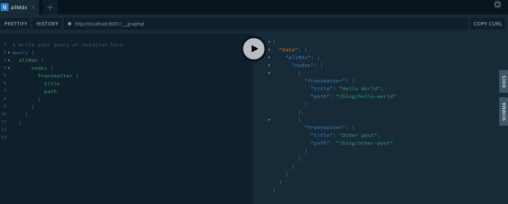
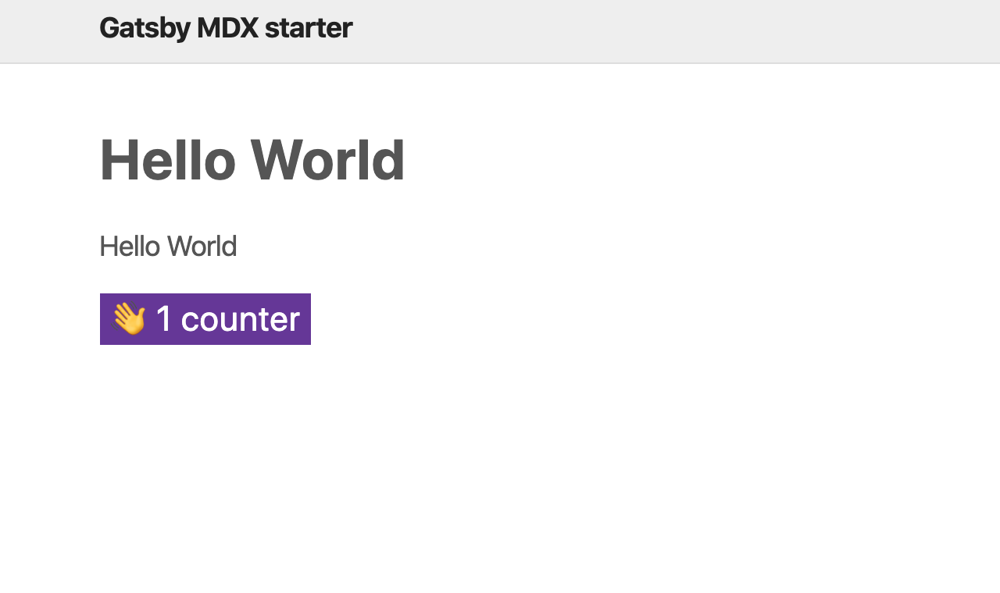

import ReadMore from "../../../src/components/ReadMore/Index";

In this post, we will be looking into how to create pages programmatically using MDX in Gatsby.

To get up and running, we need to install a couple of plugins

```shell
npm i gatsby-plugin-mdx @mdx-js/mdx @mdx-js/react
```

Then we need to configure gatsby-mdx inside `gatsby-config.js`

```js
plugins: [
  {
    resolve: "gatsby-plugin-mdx",
    options: {
      defaultLayouts: {
        default: require.resolve("./src/components/Layout.js"),
      },
    },
  },
];
```

So first we need to resolve the plugin `gatsby-plugin-mdx` because we also want to pass in options object which defines what layout that we want to use in our MDX files.

Note: `require.resolve` give us the absolute path name.

As a result, any MDX files that we load will be loaded into the Layout.js template that we defined in the `gatsby-config`.

Now that we have installed the plugin, the plugin will look for mdx files in the pages or posts directory which we defined in gatsby-config.

So to get the post pages into gatsby, we are going to use another plugin `gatsby-source-filesystem`

```shell
npm i gatsby-source-filesystem
```

to get them to the data layer so that we can access them.

The gatsby source file system is a way to use local files as part of the graphql data layer.

Once it gets installed, we need to update gatsby config to resolve source filesystem plugin

```js
plugins: [
  {
    resolve: "gatsby-plugin-mdx",
    options: {
      defaultLayouts: {
        default: require.resolve("./src/components/Layout.js"),
      },
    },
  },
  {
    resolve: "gatsby-source-filesystem",
    options: {
      name: "posts",
      path: `${__dirname}/content/posts`,
    },
  },
];
```

As a result, it will load anything that it finds in the path `/content/posts` as part of the data layer, and because we have gatsby MDX plugin installed it's going to look for MDX files and transform those into graphql nodes.

The whole reason for using MDX is because we want to add some sort of interactivity in the markup generated pages.

Now that we added configuration to look for files in the system and transform them to graphql nodes, we would need to generate those post files as pages programmatically using gatsby API `createPages` by configuring that in `gatsby-node.js`.

Gatsby in itself has a couple of available APIs that can be used to extend how gatsby works, inside of those you can export a function that is the same name as one of the hooks that gatsby looks for. As a result, gatsby will do those instructions at the build phase.

In this case, we want to create pages so we use `exports.createPages` and because we are going to load data we make the function async.

Gatsby will give us a couple of utility methods such as actions, graphql helper and reporter(which can be used in case you want to put something in the console, it's a gatsby internal kind of console.log)

```js
exports.createPages = async ({ actions, graphql, reporter }) => {
  const result = await graphql(`
    query {
      allMdx {
        nodes {
          frontmatter {
            path
          }
        }
      }
    }
  `);

  if (result.errors) {
    reporter.panic("failed to create posts ", result.errors);
  }

  const pages = result.data.allMdx.nodes;

  pages.forEach((page) => {
    actions.createPage({
      path: page.frontmatter.path,
      component: require.resolve("./src/templates/postTemplate.js"),
      context: {
        pathSlug: page.frontmatter.path,
      },
    });
  });
};
```

In the createPage function, we will use graphql helper to fetch the nodes from the data layer by passing a graphql query as you can see in the snippet above.

Then, we create the pages using `actions.createPage` as we loop through these pages that came back as an array to generate them programmatically as you can see in the screenshot below



`actions.createPage` takes an options object as a parameter that has 3 properties: path, component and context.
`Path` is what we have defined in the MDX frontmatter.
`Component` takes in the path to the template you want to use for these pages. Below is a sample snippet used as page template.

```jsx
import { graphql } from "gatsby";
import { MDXRenderer } from "gatsby-plugin-mdx";
import React from "react";

import Layout from "../components/Layout";

export const query = graphql`
  query ($pathSlug: String!) {
    mdx(frontmatter: { path: { eq: $pathSlug } }) {
      frontmatter {
        title
        path
      }
      body
    }
  }
`;

const Post = ({ data: { mdx: post } }) => {
  const { title } = post.frontmatter;
  const { body } = post;
  return (
    <div>
      <Layout>
        <h1>{title}</h1>
        <MDXRenderer>{body}</MDXRenderer>
      </Layout>
    </div>
  );
};

export default Post;
```

`Context` takes in an object with pathSlug as its property which value is the page path.

Once we finish adding the above, now we can add interactivity to our MDX pages which would look like this

```mdx
---
path: "/blog/hello-world"
date: "2020/01/01"
title: "Hello World"
summary: "hello world post"
---

import Counter from "../../../src/components/Counter";

Hello World

<Counter />
```



**Following the post and you can find a starter repo [here](https://github.com/gabroun/gatsby-mdx-starter) that shows usage of MDX pages**

If you found this post helpful, then you will love this one as it shows you [how to add syntax highlighting to MDX files](/blog/syntax-highlighting-in-gatsby-mdx/).

<ReadMore link1="/blog/syntax-highlighting-in-gatsby-mdx/" />
