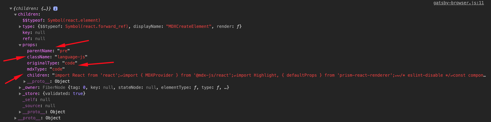

import ReadMore from "../../../src/components/ReadMore/Index";

In this post, we will be looking into how to enable syntax highlighting for [Gatsby MDX files](/blog/gatsby-create-pages-with-mdx/) using [prism-react-renderer](https://github.com/FormidableLabs/prism-react-renderer)

first, we need to install a couple of modules

```text
npm i prism-react-renderer @mdx-js/react
```

Then, we create the component which we will use in the `<MDXProvider/>` that is going to provide a wrapper replacement for our application.

```javascript:title=gatsby-browser.js
const component = {
  pre: (props) => {
    const className = props.children.props.className || "";
    const matches = className.match(/language-(?<lang>.*)/);
    return (
      <Highlight
        {...defaultProps}
        code={props.children.props.children}
        language={
          matches && matches.groups && matches.groups.lang
            ? matches.groups.lang
            : ""
        }
      >
        {({ className, style, tokens, getLineProps, getTokenProps }) => (
          <pre className={className} style={style}>
            {tokens.map((line, i) => (
              <div {...getLineProps({ line, key: i })}>
                {line.map((token, key) => (
                  <span {...getTokenProps({ token, key })} />
                ))}
              </div>
            ))}
          </pre>
        )}
      </Highlight>
    );
  },
};
```

To render the code block we added in MDX file to show up on the page we will access props of the child component of `<pre/>` component as markdown code blocks get compiled into a `<pre/>` component wrapping the code component.
We can dive a level deeper to get the code by using `props.children.props.children`, as you can see from the screenshot below.



To get the language attribute of the code block rather than hardcoding the value we look into MDX code block as it comes through as a class name that will look like language-className (for example language-javascript).

````text
```javascript
const text = 'World'
console.log(`Hello ${text}`)
```
````

To get the language defined in the code component in the MDX file, we will drill down at `props.children.props.className`, if there is no class name then we might have not put a language on our code block in which case we will default to empty strings.
Then we use a name capture group in regex with the name lang to get the language of the language-className. if there are matches

```javascript
const matches = className.match(/language-(?<lang>.*)/);
```

To enable syntax highlighting in MDX files by adding the following snippet below in `gatsby-browser.js`

```javascript:title=gatsby-browser.js
import React from "react";
import { MDXProvider } from "@mdx-js/react";
import Highlight, { defaultProps } from "prism-react-renderer";

/* eslint-disable */
const component = {
  pre: (props) => {
    const className = props.children.props.className || "";
    const matches = className.match(/language-(?<lang>.*)/);
    return (
      <Highlight
        {...defaultProps}
        code={props.children.props.children}
        language={
          matches && matches.groups && matches.groups.lang
            ? matches.groups.lang
            : ""
        }
      >
        {({ className, style, tokens, getLineProps, getTokenProps }) => (
          <pre className={className} style={style}>
            {tokens.map((line, i) => (
              <div {...getLineProps({ line, key: i })}>
                {line.map((token, key) => (
                  <span {...getTokenProps({ token, key })} />
                ))}
              </div>
            ))}
          </pre>
        )}
      </Highlight>
    );
  },
};

export const wrapRootElement = ({ element }) => {
  return <MDXProvider components={component}>{element}</MDXProvider>;
};
```

**Following the post and you can find a starter repo [here](https://github.com/gabroun/gatsby-mdx-starter) that shows usage of mdx pages and syntax highlighting**

<ReadMore link1="/blog/gatsby-create-pages-with-mdx/" />
