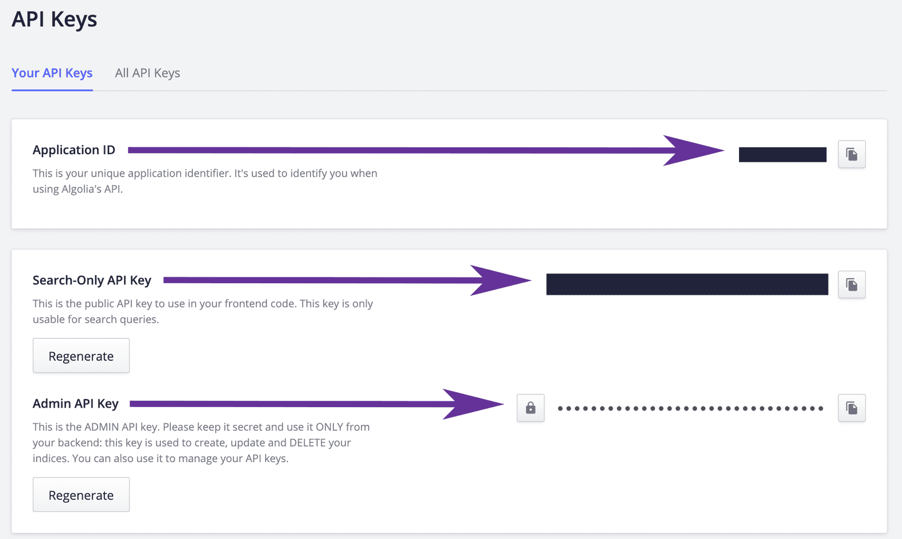
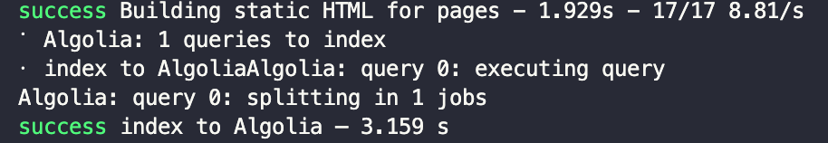
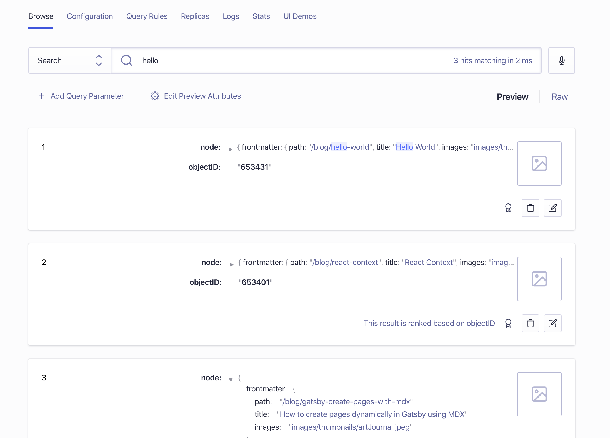
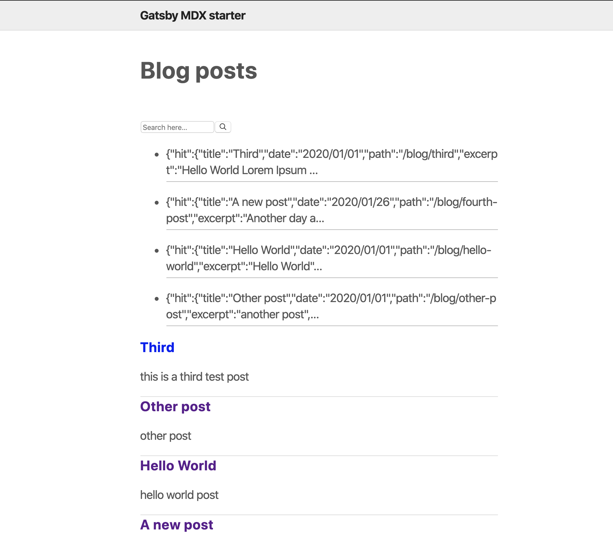
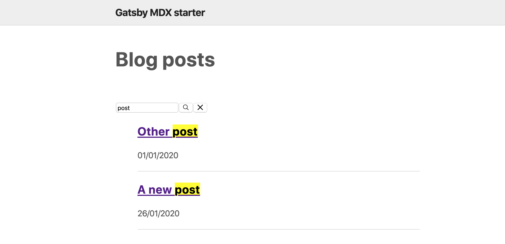

In this post, we will be looking into how to add algolia search to your gatsby site. we will see how to configure Algolia in gatsby and add Algolia's built-in component..

To setup algolia search, first, you need to:

- create an account at algolia's website [here](https://www.algolia.com/users/sign_up)
- once done, you create an index you can name whatever you want (blog for example)

After that, we can grab the API keys and put them in your `.env` which you can find them here


```text
GATSBY_ALGOLIA_APP_ID="xxxx"
GATSBY_ALGOLIA_INDEX_NAME="test"
ALGOLIA_API_KEY="xxx"
GATSBY_ALGOLIA_SEARCH_KEY="xxx"
```

## Configuration

Now moving back to code, by installing a couple of plugins that we are going to use

```shell
npm install algoliasearch dotenv gatsby-plugin-algolia react-instantsearch-dom
```

After installing the gatsby plugin it will allow us to fetch the data with GraphQl and send it to algolia.

Now that we install the plugins, we can start adding the configuration in `gatsby-config` to fetch the data from the build and insert it into the index in algolia.

To do so, we create the query as follow

```graphql
const blogQuery = `
  {
   posts: allMdx(
    filter: { fileAbsolutePath: { regex: "/posts/" } }
  ) {
    edges {
      node {
        objectID: id
        frontmatter {
          title
          date
          path
        }
        excerpt(pruneLength: 5000)
      }
    }
  }
  }
`;
```

and then add the transformer method which is just mapping the data

```javascript {5-11}
const settings = { attributesToSnippet: [`excerpt:20`] };
const queries = [
  {
    query: blogQuery,
    transformer: ({ data }) =>
      data.posts.edges.map(({ node: { frontmatter, ...rest } }) => {
        return {
          ...frontmatter,
          ...rest,
        };
      }),
    indexName: process.env.GATSBY_ALGOLIA_INDEX_NAME,
    settings,
  },
];
```

Basically what the above snippet does is the `queries` object grab the GraphQL json data and turning them each into own separate object that we want algolia to index from Gatsby GraphQl layer which is going to contains GraphQl query, optional index name, transformer function and settings object.

The next step will be configuring `gatsby-plugin-algolia` as follow

```js
require("dotenv").config();
// we can pass an object with a property of path to config method which would look
// like this for example {path: '.env.production'} in case if you want to configure for different modes

module.exports = {
  plugins: [
    {
      resolve: `gatsby-plugin-algolia`,
      options: {
        appId: process.env.GATSBY_ALGOLIA_APP_ID,
        apiKey: process.env.ALGOLIA_API_KEY,
        indexName: process.env.GATSBY_ALGOLIA_INDEX_NAME, // for all queries
        queries,
        chunkSize: 10000, // default: 1000
      },
    },
  ],
};
```

the plugin takes an options object with the keys we added earlier in the env file and the queries object which contains your query (you can pass more than one query to that, for example, a query for posts and a different one for pages) and the transformer method for mapping, index name and any settings you wish to pass.

Once the configuration is done, you can run your project in production mode to send the data to algolia so that you can test by running `gatsby build` and it will look like the following


If you look in your dashboard after the build finish, you should be able to see the data as well


Now we can move to the frontend part after configuration and indexing part finished.

## Frontend

In this section, we will be looking into how to install algolia search to your gatsby site.

### Algolia Search component

To do that, first, we create a new component call it `Search.js` which would utilise algolia's instant-search component (you can check the [docs](https://www.algolia.com/doc/guides/building-search-ui/installation/react/) for more info)

```jsx {10-16}
import algoliasearch from "algoliasearch/lite";
import { InstantSearch, SearchBox, Hits } from "react-instantsearch-dom";
import React from "react";

const appId = process.env.GATSBY_ALGOLIA_APP_ID;
const searchKey = process.env.GATSBY_ALGOLIA_SEARCH_KEY;
const searchClient = algoliasearch(appId, searchKey);

const Search = () => (
  <InstantSearch
    searchClient={searchClient}
    indexName={process.env.GATSBY_ALGOLIA_INDEX_NAME}
  >
    <SearchBox />
    <Hits />
  </InstantSearch>
);

export default Search;
```

As you can see in the above snippet, we first added `InstantSearch` component which as defined by algolia in the [docs](https://www.algolia.com/doc/guides/building-search-ui/what-is-instantsearch/react/) as a component that interact with Algolia’s API, to easily build instant-search applications.
`InstantSearch` takes two properties, `searchClient` that contains your app id and search key which was defined in env earlier and indexName that you defined in algolia's account. The component has two children components, `SearchBox` component as the name implies and input field with search and delete icon and a `Hits` component (Hits are the return result from your query).
The result of the search component will look something like this


We can replace the HTML you see in the screenshot from the list of posts with the actual hits which is a good spot to do highlighting for the searched keywords etc.
To do so, we can add an attribute `hitComponent` which going to pass the data that it receives from `Hits` to the component you pass to it for example postPreview.

```jsx
import PostPreview from "./PostPreview";
<Hits hitComponent={PostPreview} />;
```

And our `PostPreview` can look something like the following where we add a link to the post and show the excerpt about the post.

```jsx
import React from "react";
import { Link } from "gatsby";
import { Highlight } from "react-instantsearch-dom";
import { css } from "@emotion/core";
const PostPreview = ({ hit }) => {
  return (
    <article>
      <h3>
        <Link to={hit.path}>
          <Highlight hit={hit} attribute="title" tagName="mark" />
        </Link>
      </h3>
      <small>{new Date(hit.date).toLocaleDateString()}</small>
      <p>
        <Highlight hit={hit} attribute="excerpt" tagName="mark" />
      </p>
    </article>
  );
};

export default PostPreview;
```

once that done, we can add another widget that does the highlighting. By default, the prop `attribute` that was to `Highlight` component is going to be enabled on all the searchable attributes, but you can limit it to a specific one that you want to make it searchable.

The `Highlight` widget is going to look for the attribute to highlight, which is going to create a span around the searched term in the content and highlight that span.

An example of adding the `Highlight` widget

```jsx
<Highlight hit={hit} attribute="title" tagName="mark" />
```

By adding the above, it is going to highlight the attribute title if it matches the search query as you can see below


As a result, now we have `Search` component that uses algolia `InstantSearch` as a base component.

**Following the post and you can find a starter repo [here](https://github.com/gabroun/gatsby-mdx-starter) that shows usage of Algolia Search component**

I hope part one showed how you can install and add algolia search component to your Gatsby site. Part two will cover how to create a custom search component with Algolia.
