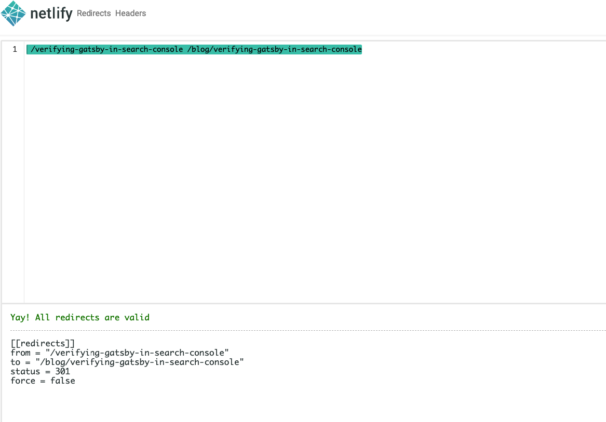

Say we wanted to migrate our posts’ route from one route to another in our site but we do not want to go through the troubles of updating it everywhere else where the URL has been shared. As we want to avoid the issues of 404 pages if the user has visited the old URL route or in case these old routes have been indexed in Google.

In order to solve this issue, we will need to look into how we can redirect users programmatically to the new URL.

---

**So in this post, we will be looking into how we can add redirects programmatically to our site especially if you are using <em>Netlify.</em>
There are 2 types of redirects**

## 1. Using Gatsby createRedirect

Gatsby API offers us a variety of utility functions that can be used to extend how gatsby works which can be configured inside `gatsby-node.js`, these instructions will be done at build time.

The one in particular that we are interested in and going to use it is `createRedirect` function which as the name suggest going to create a redirect from one page to another.

### Installation

Additionality, we need to keep in mind that server redirects doest work out of the box so we need to install a plugin to integrate redirect with the hosting service.

```text
npm i gatsby-plugin-netlify
```

Alternatively, if your choice of hosting service doesn’t have a plugin in gatsby, you can use a meta redirect plugin to generate meta redirect HTML files.

```text
npm i gatsby-plugin-meta-redirect
```

And then inside `gatsby-config.js` we add the plugin to our plugins array

```javascript:title=gatsby-config.js
plugins: [`gatsby-plugin-netlify`];
```

### Configuration

To create the redirects we need to update createPages function in `gatsby-node.js` which is going to be run once during the process of page creation.

Inside the function, we call `createRedirect` method which takes an options object that includes a couple of properties

### Example

in the example below, we can see how we can destruct createRedirect from actions object and call it to create the redirects

```javascript:title=gatsby-node.js {2,26-30}
exports.createPages = async ({ actions, graphql, reporter }) => {
  const { createRedirect } = actions;
  const result = await graphql(
    `
      query {
        allMdx {
          nodes {
            frontmatter {
              path
              images
              type
              redirects
            }
          }
        }
      }
    `
  );
  if (result.errors) {
    reporter.panic("failed to create posts ", result.errors);
  }
  const pages = result.data.allMdx.nodes;
  pages.forEach((page) => {
    const { redirects } = page.frontmatter;
    if (redirects) {
      createRedirect({
        fromPath: redirects[0],
        toPath: redirects[1],
        redirectInBrowser: true,
        isPermanent: true,
      });
    }
    actions.createPage({
      path: page.frontmatter.path,
      component: require.resolve("./src/templates/postTemplate.js"),
      context: {
        pathSlug: page.frontmatter.path,
        image: `resources/${page.frontmatter.images}`,
      },
    });
  });
};
```

While looping through the results from the GraphQL query, we can check if the page has frontmatter redirects property which is going to be an array that looks like the following

```text
...
redirects:
[
'/gatsby-create-pages-with-mdx',
'/blog/gatsby-create-pages-with-mdx',
]
```

If it does contain the redirects array, then it is going to create a redirect for that specific page to redirect visiting users to the new path specified.
We can check out the available properties that createRedict offers in the [Gatsby docs](https://www.gatsbyjs.com/docs/actions/#createRedirect)

```javascript
createRedirect({
  fromPath: redirects[0],
  toPath: redirects[1],
  redirectInBrowser: true,
  isPermanent: true,
});
```

This will allow us to create redirects for static generated sites without the need to mess with routing in the redirects file.

---

## 2. Using Netlify \_redirects File

We can add all of our redirects manually inside `_redirects` file. In order to make sure that we are following the redirect syntax that Netlify uses, we can check it in the [docs](https://docs.netlify.com/routing/redirects/#syntax-for-the-redirects-file) and test the syntax in the playground they offer [here](https://play.netlify.com/redirects).

### Example

In the following below we can take a look at the example of redirects in their playground.

```text
/verifying-gatsby-in-search-console /blog/verifying-gatsby-in-search-console
```

Which will result in the following



## Conclusion

In order to do redirects in gatsby, we have the options of either using \_redirects file or following the gatsby way of using createRedirect utility inside gatsby-node.js.
