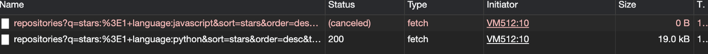

In this post, we will be looking into `AbortController` and how can we use it to cancel network requests.

We know that `fetch` is a method that sends a network request and returns a promise, but what if we wanted to cancel this ongoing request.

For example, consider this scenario where we want to implement a search functionality that displays results during user input, however user typing speed can vary from one to another and we want to cancel the preceding request. We can do it by minimising the number of server requests using `AbortController`.

## Syntax

`AbortController` is an object (controller object) that allows you to abort one or more requests (async requests) when needed.

- signal property which allows setting event listener on the property.
- abort() method which will set the signal aborted flag.

  So when abort() method is called, it will cancel the DOM request before it has been completed and setting the aborted flag to true.

## Usage

In order to cancel a fetch request generally, we need to perform 3 steps:

1. Create an `AbortController` instance which has a signal property (read-only property)

```javascript
// creare new object instance of abortContoller
let aborter = new AbortController();
```

2. Pass the `signal` property as a fetch option for signal

```javascript
// we get the signal and pass it to the fetch request as param
let signal = aborter.signal; // signal is read only
const url =
  "https://api.github.com/search/repositories?q=stars:%3E1+language:javascript&sort=stars&order=desc&type=Repositories";
fetch(url, {
  method: "GET",
  signal,
})
  .then((response) => response.json())
  .then((res) => {
    aborter = null;
    return res;
  })
  .catch((error) => {
    if (error.name === "AbortError") return;
    console.log("Error ", error);
  });
```

3. Call abortController’s `abort()` method to cancel all fetches that are pending which use the signal.

```javascript
aborter.abort();
```

## Example

The following snippet shows how to use abortController with fetch. Here is the full example:

```javascript
let aborter = null;
const getRepos = (lang) => {
  // cancel pending request if there is any
  if (aborter) aborter.abort();
  aborter = new AbortController();
  let signal = aborter.signal;
  const url = `https://api.github.com/search/repositories?q=stars:%3E1+language:${lang}&sort=stars&order=desc&type=Repositories`;
  return fetch(url, {
    method: "GET",
    signal,
  })
    .then((response) => response.json())
    .then((res) => {
      aborter = null;
      return res;
    })
    .catch((error) => {
      if (error.name === "AbortError") return;
      console.log("Error ", error);
    });
};
// the first call will be aborted
getRepos("javascript").then((res) => {
  console.log(res);
});
getRepos("python").then((res) => {
  console.log(res);
});
```

The reason we are defining the aborter variable outside the function scope so that regardless of how many times the function is called or how many requests are still pending, it will only display the results of the last request that was submitted.

And here you can see the example above in action with the first call being aborted and the second one going through.


## Conclusion

In this post, we looked at `AbortController` and how can we use it to cancel network requests with an example usage with fetch.
